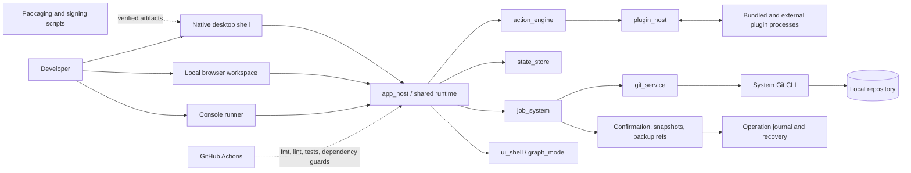

# BranchForge — Safety-First Git Workspace

> Portfolio framing: previous independent work by an Oferli technical team member. BranchForge predates this Oferli portfolio entry and is not presented as an Oferli-originated product.

## Project Summary

**Project type:** Developer tool / Git client / desktop productivity application  
**Platforms:** Native desktop, local browser interface, and console runner  
**Main technologies:** Rust 2024, eframe/egui, HTML/CSS, Git CLI, Serde, framed JSON RPC, OpenSSL, and GitHub Actions

BranchForge is a Rust-based Git workspace that combines routine repository work, advanced branch operations, recovery controls, and plugin extensibility in one shared runtime. Native, browser, and console interfaces all operate on the same action, job, and state model, while a dedicated service owns real Git CLI execution. Repository history shows one contributor across all 106 commits; the exact public role title and personal scope should still be confirmed.

# Portfolio Case Study

## Project Overview

- **Project type:** Independent software product and developer tool
- **Industry/domain:** Software development tooling and version-control productivity
- **Platform:** Native desktop application, local web interface, console runner, plugin runtime, and release toolchain
- **Client:** Not applicable; no client-commissioned relationship is represented
- **Approximate developer role:** Independent product engineer / Rust engineer, inferred from single-contributor repository history
- **Release state visible in repository:** Tagged MVP and `v1.0.1` releases; the public `v1.0.1` release includes a Linux x86_64 package and integrity files

The codebase is organized as a Rust workspace with twelve core crates and seven bundled plugins. It includes product documentation, architecture boundaries, quality gates, release checklists, support guidance, packaging scripts, and extensive automated tests.

## The Problem

Git is flexible, but that flexibility creates friction. Everyday actions are scattered across commands and flags, advanced operations require a precise understanding of repository state, and mistakes around reset, rebase, checkout, or reference manipulation can be costly. Teams also need confidence that a graphical client is performing real, understandable Git operations instead of hiding state behind an opaque workflow.

BranchForge appears designed to make these workflows more accessible while keeping safety and recoverability visible. It presents repository state through consistent interfaces, routes changes through a controlled job system, marks higher-risk operations, and records enough information to diagnose or recover from failures.

**Needs confirmation:** original product brief, primary target users, and any documented user research.

## The Solution

BranchForge implements a layered application around a shared host runtime:

1. A user opens a local repository through the native desktop shell, browser workspace, or console runner.
2. The active interface dispatches an action rather than calling Git directly.
3. The action engine resolves the action through the host and plugin catalog.
4. The job system applies locking and operation policy, then delegates repository work to `git_service`.
5. `git_service` is the only workspace layer allowed to invoke the system Git CLI. It normalizes command execution and parses results into application models.
6. State updates, selections, diagnostics, and operation results flow back to every interface through shared models.
7. For higher-risk operations, the runtime can request confirmation, record pre/post reference state, create backup refs, and write recovery-aware journal entries.
8. Bundled and external plugins run as separate processes and communicate through a versioned framed protocol.

The implemented product surface covers everyday status and commit work, focused diff and staging, history and search, branches, tags, compare, conflict handling, rebase/reset/merge flows, stash, worktrees, submodules, LFS capability handling, provider-oriented pull-request listing, plugin management, diagnostics, and release operations.

## Main Features

- Open and refresh local Git repositories.
- Inspect tracked, staged, unstaged, and untracked changes.
- Stage or unstage files, hunks, and selected line indices.
- Discard selected worktree changes through guarded actions.
- Create commits and amend commit messages.
- Load history, search by author/text/hash, inspect details and diffs, and blame files.
- Create, rename, checkout, compare, and delete branches.
- Create, inspect, compare, push, and delete tags where supported by the action catalog.
- Compare refs and inspect ahead/behind counts, commits, and combined diffs.
- Merge, cherry-pick, revert, reset, and interactive-rebase-oriented workflows.
- Continue or abort operations and surface conflict/recovery state.
- Manage stash entries, worktrees, submodules, and optional Git LFS actions.
- Detect repository capabilities before enabling unsupported controls.
- Journal operations and expose runtime, job, plugin, and recovery diagnostics.
- Create backup references around selected destructive operations.
- Discover, install, enable, disable, remove, update, and inspect plugins.
- Validate plugin protocol compatibility, manifests, permissions, and signatures.
- Package, sign, checksum, verify, and document application releases.
- Run the same product runtime through console, browser, and native desktop shells.

Repository documentation describes a future WASM capability model for plugins. Current external plugins are process-isolated; a WASM sandbox should not be presented as implemented.

## Technical Architecture

The workspace separates user interfaces, orchestration, state, jobs, Git execution, graph modeling, and plugin concerns into explicit crates. `app_host` wires the product together. `action_engine` routes action requests, `state_store` holds runtime selections and snapshots, `job_system` coordinates operation execution and policies, and `git_service` owns Git CLI access. `ui_shell` provides renderer-independent view models, while `app_desktop` and `app_gui` expose native and browser interfaces. `graph_model` supplies renderer-independent commit-graph structures.

Plugins depend on the shared protocol rather than on `git_service`. The host launches plugin processes and exchanges framed JSON messages over standard input/output. This preserves a narrow extension boundary and prevents plugins from silently bypassing the host’s Git-operation policy.

No standalone application database, cache server, or message broker was found. Runtime state and recovery metadata are local to the application and repository context. The repository includes CI and packaging automation rather than hosted service infrastructure.

This diagram intentionally omits machine paths, private provider endpoints, credential locations, signing material, and release-host details.

## Tech Stack

### Frontend

- Rust-rendered local HTML and CSS browser workspace
- Server-side form/action handling in `app_gui`
- eframe/egui native desktop interface
- Renderer-independent view models in `ui_shell`
- Commit graph models in `graph_model`

### Mobile

- No native or mobile-specific application was found

### Backend

- Rust 2024 workspace
- Shared host runtime in `app_host`
- Serde-based protocol and state models
- Process execution and Git parsing in `git_service`
- Asynchronous job and action orchestration through workspace crates

### Database

- No standalone database layer was found

### Infrastructure

- Local desktop/browser execution
- Shell-based development, packaging, signing, and release-verification scripts
- Git and optional Git LFS as local runtime capabilities
- OpenSSL-based signature verification paths

### CI/CD

- GitHub Actions
- Stable Rust toolchain
- Rust cache
- Dependency-boundary guard script
- `cargo fmt --all --check`
- Workspace Clippy with warnings denied
- Full workspace tests

### Testing

- Rust unit tests
- Git fixture and integration tests
- Host/runtime smoke suites
- Safety and recovery regression suites
- Plugin handshake, contract, SDK, and bundled-plugin tests
- End-to-end history/diff and action-response tests

The repository contains 327 functions marked with Rust test attributes. This is a source-level count, not a claim about line or branch coverage.

### Monitoring

- Runtime diagnostics and capability reporting
- Operation journal and recovery summaries
- Plugin inventory and health reporting
- Job/action result records and local logs

No external APM, telemetry backend, or hosted monitoring service was found.

### Integrations

- System Git CLI
- Optional Git LFS
- Operating-system credential storage
- GitHub/GitLab-oriented provider support for pull-request listing
- OpenSSL for plugin and release signature verification

### Other

- Versioned plugin API and SDK
- Framed JSON RPC over process standard I/O
- Plugin manifests, compatibility metadata, permissions, and risk classifications
- Release notes, checksums, public-key artifacts, packaging verification, and regression matrices

## Technical Highlights

### 1. A single controlled boundary for Git

Repository rules and dependency guards require all Git CLI execution to stay inside `git_service`. This matters because process spawning, output parsing, path handling, error translation, and repository capability checks are security- and correctness-sensitive; keeping them centralized prevents each interface or plugin from developing inconsistent behavior.

### 2. Recovery designed around real reference changes

The operation model includes confirmation levels, operation journaling, pre/post reference snapshots, backup references, and recovery-oriented actions. This is more meaningful than a generic “undo” button because advanced Git operations can rewrite refs and working-tree state in different ways.

### 3. Shared runtime across native, browser, and console interfaces

All three interfaces use the same host, action catalog, job system, and state models. This reduces the risk that one shell handles operations differently and provides a practical path for testing workflows through a lightweight console while delivering desktop and browser experiences.

### 4. Out-of-process plugin architecture

Bundled and external plugins communicate through a versioned protocol and framed standard-I/O transport. Separate processes improve failure isolation and make protocol compatibility explicit, while permission metadata and signature checks provide visible trust signals.

### 5. Testable architecture boundaries

Crate ownership and allowed dependency directions are documented, and automated dependency guards enforce key rules. The workspace also forbids unsafe Rust and denies `dbg!`, `todo!`, and `unwrap()` through shared lint configuration.

### 6. Productized release discipline

The repository includes versioned release notes, known-issues documents, support and recovery guidance, regression matrices, package checks, checksums, public-key material, signing scripts, and published release artifacts. These are concrete signs of a product release process rather than only a development build.

### 7. Capability-aware interface behavior

The UI can query repository/runtime capabilities and disable unsupported controls such as Git LFS actions when the capability is unavailable. This reduces dead-end interactions and exposes environmental limitations directly to the user.

## Engineering Decisions

### Centralize Git CLI execution in `git_service`

- **Decision:** Forbid direct Git calls outside one workspace crate.
- **Likely reason:** Keep command construction, parsing, error handling, and repository safety consistent across interfaces and plugins.
- **Trade-off:** The service becomes a large integration boundary and must model a broad Git feature set. It also depends on the installed Git executable and its output semantics.

### Reuse one runtime across three shells

- **Decision:** Route native, browser, and console interactions through the same action/runtime system.
- **Likely reason:** Avoid duplicating business logic and make workflows testable outside the full desktop UI.
- **Trade-off:** Shared models must serve different interaction patterns, which can make UI-specific state and asynchronous feedback harder to express. **Reason should be confirmed with the original developer.**

### Run plugins out of process

- **Decision:** Use framed messages over process standard I/O instead of loading plugin code directly into the host.
- **Likely reason:** Improve crash isolation and establish a versioned, language-neutral protocol boundary.
- **Trade-off:** Process lifecycle, timeouts, framing, diagnostics, installation, compatibility, and distribution become additional engineering concerns.

### Add backup refs and an operation journal

- **Decision:** Preserve reference context and record operations around selected higher-risk changes.
- **Likely reason:** Give users a practical recovery path when a destructive Git workflow fails or produces an unintended result.
- **Trade-off:** Recovery metadata and backup refs need lifecycle rules, clear UX, and testing so that safety mechanisms do not create confusing repository state.

### Use strict workspace-wide lints and dependency guards

- **Decision:** Forbid unsafe Rust, deny selected problematic macros/methods, and test crate dependency rules in CI.
- **Likely reason:** Maintain reliability across a growing multi-crate workspace.
- **Trade-off:** Some implementation shortcuts and third-party integration patterns require more explicit error handling or wrapper code.

### Implement the local browser UI without a separate web framework

- **Decision:** Render the workspace and handle local HTTP interactions inside the Rust GUI crate.
- **Likely reason:** Keep the local browser surface close to the shared runtime and reduce the number of frontend build systems. **Reason should be confirmed with the original developer.**
- **Trade-off:** Accessibility, routing, incremental updates, and complex client-side interactions require more manual implementation than in a mature frontend framework.

## Challenges

### Confirmed from repository

- Modeling a large Git feature surface without allowing UI or plugin layers to bypass the central Git boundary.
- Making destructive or history-rewriting operations observable and recoverable.
- Keeping state, selections, job results, and actions consistent across console, browser, and desktop shells.
- Supporting plugin discovery, protocol compatibility, lifecycle, permissions, signatures, and failure handling.
- Parsing real Git output and testing workflows against temporary repositories and integration fixtures.
- Handling operation continuation/abort paths and conflict-oriented workflows.
- Packaging and verifying release artifacts with checksums and signatures.
- Preserving architectural constraints as the workspace grew across multiple sprints and crates.

### Likely / needs confirmation

- Balancing advanced Git capabilities with an interface that remains approachable for routine work.
- Performance and visual clarity on very large repositories or histories.
- Cross-platform packaging expectations beyond the published Linux x86_64 artifact.
- The amount of real-user feedback incorporated into the beta and `v1.0.1` release.
- Whether plugin distribution was used outside the bundled and sample/template plugins.
- Whether provider integrations were exercised against production GitHub or GitLab accounts.

## Developer Contribution

Repository history attributes all 106 commits to a single contributor. On that evidence, the developer appears to have owned the product end to end, including:

- Rust workspace and crate architecture
- Git service and repository operation modeling
- Action, job, state, and recovery systems
- Plugin protocol, host, SDK, security metadata, and sample/template plugins
- Console, browser, and native desktop interfaces
- Testing and regression suites
- CI, packaging, signing, verification, and release documentation

**Needs confirmation from developer: exact personal contribution and preferred public role wording.** A single Git author is strong evidence of repository authorship but does not prove that no uncredited design, testing, product, or code contributions occurred.

Questions needed to finalize this section:

1. Was the codebase implemented entirely by you, or were there uncredited design, QA, product, or code contributors?
2. Which public role title is most accurate: creator, lead developer, product engineer, Rust engineer, or another title?
3. Did you personally design the crate architecture and centralized Git-service boundary?
4. Did you implement all three interfaces, or should any UI work be attributed separately?
5. Did you design and implement the plugin runtime and release-signing workflow?
6. Should the public case study link to the original `galetaa/BranchForge` repository and show the public GitHub handle?
7. Were the published releases tested or used by people outside the development environment?
8. Are there specific technical areas you prefer not to associate with your public portfolio?

## Outcome

### Technical outcome

The repository provides a functioning Git workspace with real repository operations, three user interfaces over a common runtime, advanced history and branch workflows, plugin extensibility, safety/recovery controls, automated quality gates, and a documented release process. The public repository includes tagged MVP and `v1.0.1` releases; the latter includes a Linux package and verification artifacts.

### Business outcome

**Needs confirmation from developer.** The repository does not establish active-user counts, team adoption, paid usage, productivity gains, commercial outcomes, or production scale. No such metrics should be published without evidence and permission.

## GitHub Portfolio Card

**Project:** BranchForge  
**Category:** Developer tools / Git client  
**Stack:** Rust, eframe/egui, HTML/CSS, Git CLI, framed JSON RPC, GitHub Actions  
**Built:** A multi-interface Git workspace with advanced repository operations, process-isolated plugins, and safety-first recovery controls.  
**Key value:** Demonstrates end-to-end Rust product engineering across Git integration, desktop UI, extensibility, testing, and release automation.  
**Case Study:** `[Add Oferli case-study link]`

## Visual Assets Checklist

1. **Status workspace** — demonstrates the redesigned desktop information hierarchy, repository state, staging controls, and focused file workflow.
2. **Focused diff** — demonstrates hunk- and line-oriented inspection and the app’s code-review-style workspace.
3. **Filtered commit history** — demonstrates history search, commit controls, and a safe synthetic portfolio commit.
4. **Branch management** — demonstrates branch creation, checkout, rename/delete controls, and the separation of advanced ref operations.
5. **Operation journal** — demonstrates completed operation records, runtime state, diagnostics, and recovery-oriented visibility.
6. **Branch compare** — demonstrates ahead/behind calculation, commit listing, and a combined ref diff.
7. **Diagnostics and plugins** — demonstrates capability detection, plugin lifecycle controls, and release/runtime operations.
8. **Architecture diagram** — demonstrates the shared runtime, central Git boundary, plugin processes, and safety layers without exposing infrastructure details.
9. **Short product GIF or video** — should show repository open, status, focused diff, branch compare, and confirmation/journal feedback using only the sanitized demo clone.

Do not add generic login, dashboard, cloud-infrastructure, database, or mobile visuals: those surfaces do not exist in this repository.

## Questions for Mikhail before publication

1. What public role title should be used for your contribution to BranchForge?
2. Was BranchForge entirely your implementation, or should any product, design, testing, or code contributions be credited?
3. Who was the primary intended user, and what original product problem were you trying to solve?
4. May the final case study link to the public source repository and mention the public GitHub handle?
5. May the redesigned screenshots and a code walkthrough be published under the Oferli organization?
6. Were there external testers, users, or teams, and may any non-sensitive adoption information be shared?
7. Is there a measurable outcome that can be supported publicly without inventing or exposing private information?
8. Which operating systems were actually validated beyond the published Linux x86_64 package?
9. Was plugin installation used outside the bundled/sample plugins, or should it be presented only as an implemented capability?
10. Cargo metadata declares MIT, but no root license file was found. Should a public license file be added to the source repository before broader promotion?
