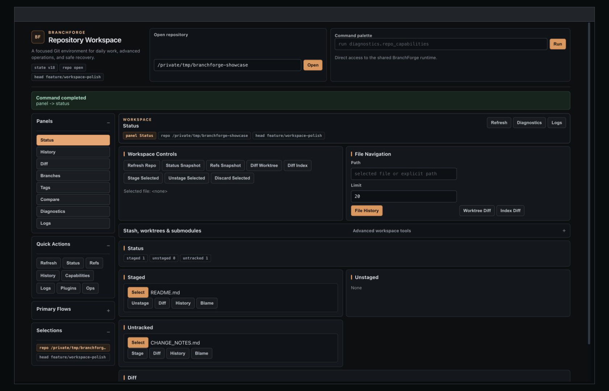
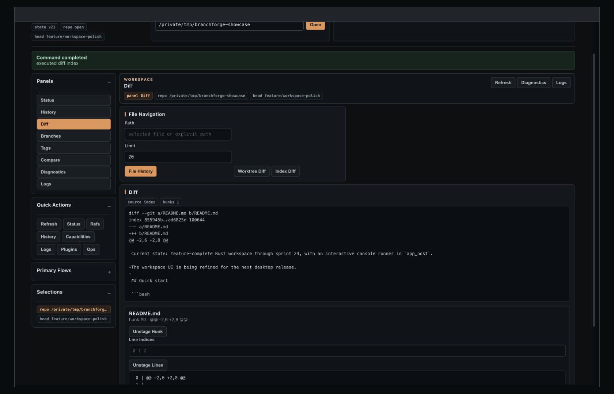
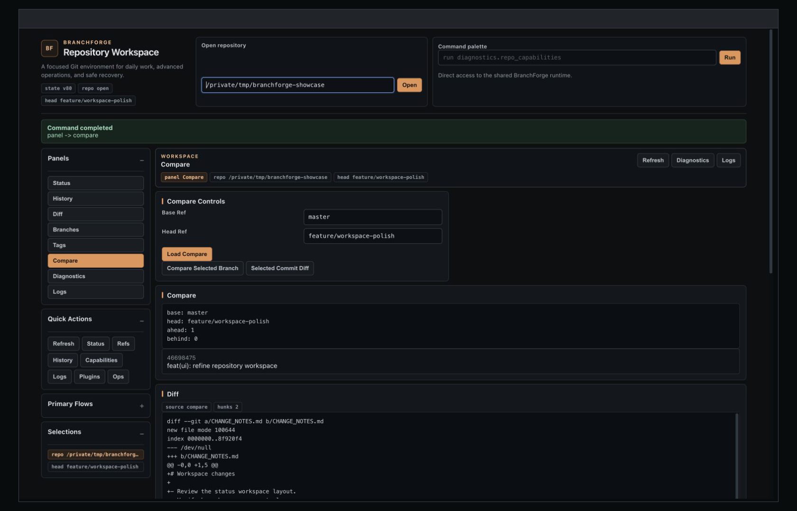
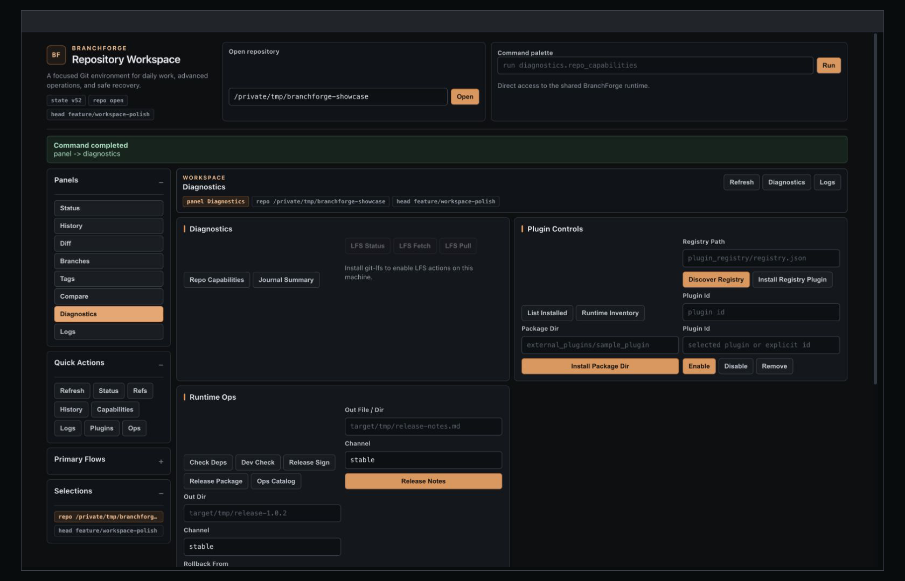
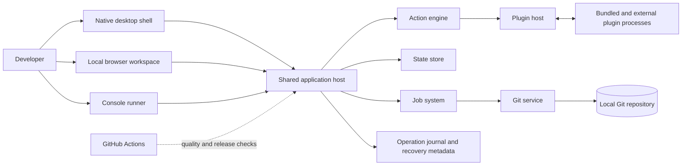

# BranchForge — Safety-First Git Workspace

> Previous independent work by an Oferli technical team member. BranchForge predates this Oferli portfolio entry and is not presented as an Oferli-originated product.

BranchForge is a Rust-based Git workspace that brings routine repository work, advanced branch operations, recovery controls, and extensibility into one shared runtime. It provides native desktop, local browser, and console interfaces over real Git operations, with process-isolated plugins, an operation journal, backup references, and release verification built into the product architecture.

**Stack:** Rust 2024, eframe/egui, HTML/CSS, Git CLI, framed JSON RPC, OpenSSL, GitHub Actions.

## Product Visuals

### Focused repository workflows

### Extensibility and diagnostics

All captures were produced from a local, sanitized demonstration clone. The paths, branch names, working-tree changes, and demonstration commit were created specifically for the portfolio; no credentials, private repositories, customer data, or production infrastructure are shown.

## Overview

- **Category:** Developer tools / Git client / desktop productivity
- **Platforms:** Native desktop application, local browser interface, and console runner
- **Project model:** Independent software product; no client is represented
- **Creator:** Mikhail, now an Oferli technical team member
- **Validated systems:** macOS and Debian 12/13
- **Original source:** [galetaa/BranchForge](https://github.com/galetaa/BranchForge)
- **Release evidence:** Tagged versions `v0.1.0-mvp` and `v1.0.1`, including published Linux artifacts for `v1.0.1`
- **Contribution:** Mikhail confirmed that he created and implemented the complete project; repository history independently attributes all 106 commits to one contributor

## The Problem

Git supports far more than status, commit, and checkout, but advanced operations often require developers to remember commands, understand repository state, and recover safely when a workflow fails. Mikhail created BranchForge to make day-to-day Git work more convenient, placing everyday and advanced repository workflows behind a consistent interface while preserving visibility into the underlying operation and providing recovery paths for destructive changes.

## The Solution

The repository implements a modular Rust workspace with a shared application host. Native, browser, and console interfaces dispatch actions through the same runtime; a dedicated Git service is the only layer permitted to execute the Git CLI. Jobs, state transitions, confirmation policies, plugin processes, and operation records are handled by separate crates with explicit dependency boundaries.

BranchForge covers repository opening, status and staging, history and diff inspection, branches and tags, comparison, conflict and recovery workflows, and selected advanced operations such as rebase, worktrees, submodules, stash, and Git LFS. Bundled and external plugins use a versioned protocol and out-of-process transport, while release scripts package, sign, and verify artifacts.

## Main Features

- Repository status, file selection, staging, unstaging, discard, and commit/amend workflows
- File, hunk, and line-level diff and staging controls
- Commit history, search, details, blame, cherry-pick, and revert actions
- Branch, tag, and reference management with compare views
- Merge, reset, rebase, conflict-resolution, abort, and continue flows
- Stash, worktree, submodule, and optional Git LFS operations
- Safety classifications, confirmations, operation journal, backup refs, and recovery actions
- Shared console, local browser, and native desktop interfaces
- Bundled and external plugin discovery, compatibility checks, permissions, signing, and lifecycle controls
- Local release packaging, signing, checksum generation, and verification

## Architecture

The diagram intentionally omits local paths, provider endpoints, credentials, signing material, and packaging-specific machine details.

## Tech Stack

| Area | Technologies verified in the repository |
|---|---|
| Interfaces | Rust-rendered local HTML/CSS workspace, eframe/egui native desktop UI, interactive console runner |
| Core | Rust 2024 workspace, Serde, shared host/runtime crates |
| Git integration | System Git CLI behind a dedicated `git_service` boundary; optional Git LFS capability checks |
| Extensibility | Versioned plugin API/SDK, framed JSON messages over standard I/O, manifest compatibility and permission metadata |
| Security and release | OS credential storage, OpenSSL artifact/plugin verification, checksums, package verification scripts |
| CI/CD | GitHub Actions, rustfmt, Clippy with warnings denied, dependency-boundary checks, workspace tests |
| Testing | Rust unit, integration, smoke, plugin protocol, recovery, and end-to-end Git fixture tests |
| Diagnostics | Runtime diagnostics, operation journal, plugin health, capability reporting, structured action results |

No database, cache server, message broker, native mobile application, or external monitoring platform was found in the repository.

## Technical Highlights

- **Centralized Git boundary:** all command execution is constrained to `git_service`, which keeps parsing, process handling, and repository interaction out of UI and plugin code.
- **Safety and recovery model:** dangerous actions can require confirmation, capture reference state, create backup references, and leave journal entries that support diagnosis and recovery.
- **One runtime, three interfaces:** the console, browser workspace, and native desktop application reuse the same action catalog and state model instead of implementing separate Git behavior.
- **Process-isolated plugins:** extensions communicate through a versioned framed protocol and are classified by declared permissions and risk level.
- **Explicit crate architecture:** documented dependency directions and automated guards make architectural boundaries testable rather than informal.
- **Release integrity:** the repository includes packaging, checksums, signing, verification, release notes, and regression matrices around tagged releases.
- **Strict quality gates:** unsafe Rust is forbidden, selected Clippy escape hatches are denied, and CI runs formatting, linting, dependency, and workspace-test checks.

## Contribution

Mikhail is the creator and sole developer of BranchForge. He designed and implemented the Rust workspace, Git operations, plugin runtime, safety/recovery mechanisms, application interfaces, test suites, CI, packaging, and release tooling. Repository history supports this attribution with all 106 commits assigned to one contributor.

## Outcome

### Technical outcome

The repository delivers a functioning multi-interface Git workspace with real repository operations, advanced workflows, plugin extensibility, recovery mechanisms, automated quality gates, and signed release artifacts. A public `v1.0.1` release is available with Linux x86_64 packaging and verification files.

### Business outcome

Not disclosed. No commercial or measurable business outcomes are claimed.

## Video Walkthrough

[Add a 3–7 minute safe product and architecture walkthrough here]

The recommended recording sequence and files safe to show are documented in [VIDEO_WALKTHROUGH.md](VIDEO_WALKTHROUGH.md).

## Confidentiality Notice

This repository is a portfolio case study. It does not include a copy of the BranchForge source code, private repositories, credentials, signing keys, personal email addresses, user repository contents, or machine-specific configuration. Screenshots use synthetic portfolio data in an isolated local clone.

For the full technical analysis, see [CASE_STUDY.md](CASE_STUDY.md). For a concise client-facing version, see [SALES_SUMMARY.md](SALES_SUMMARY.md). The publication and security review is in [PUBLICATION_CHECKLIST.md](PUBLICATION_CHECKLIST.md).
